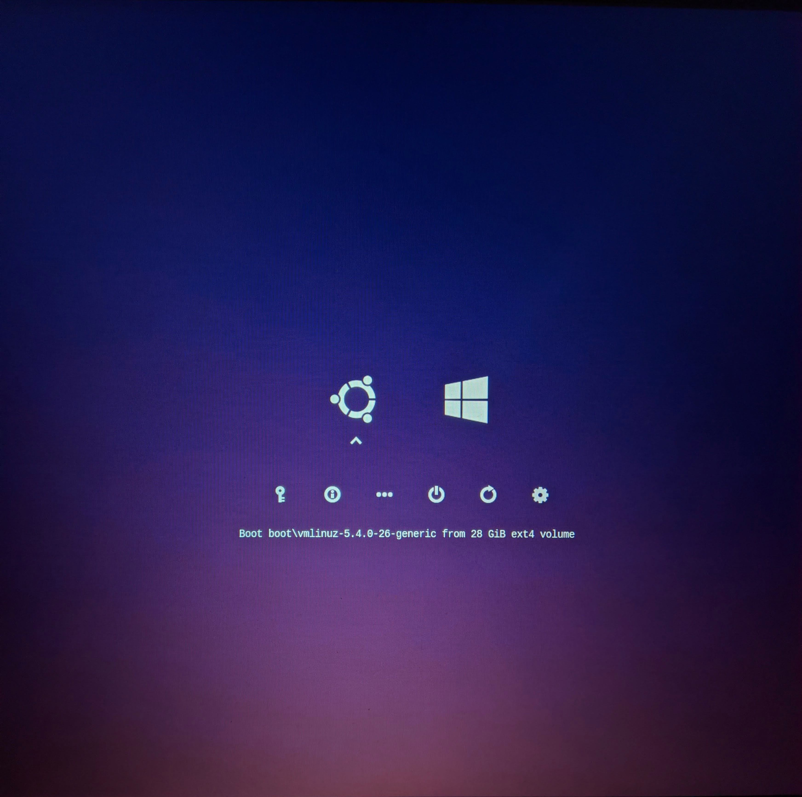

# Delnegend rEFInd

## Screenshots


## Hướng dẫn (English below)
1. Clone repo này về
2. Copy vào thư mục EFI/refind/themes
3. Thêm dòng này vào cuối file EFI/refind/refind.conf
    ```
    include themes\Delnegend-rEFInd\theme.conf
    ```

## How to install
1. Clone this repo
2. Copy onto EFI/refind/themes
3. Add this line into EFI/refind/refind.conf
    ```
    include themes\Delnegend-rEFInd\theme.conf
    ```

## Credit
- [Perseus](https://www.deviantart.com/stormophile/art/Perseus-rEFInd-805769093)
- [Minimalistic Dark rEFInd Theme](https://github.com/PillTime/rEFInd-minimal-dark)
- [Google](https://google.com)